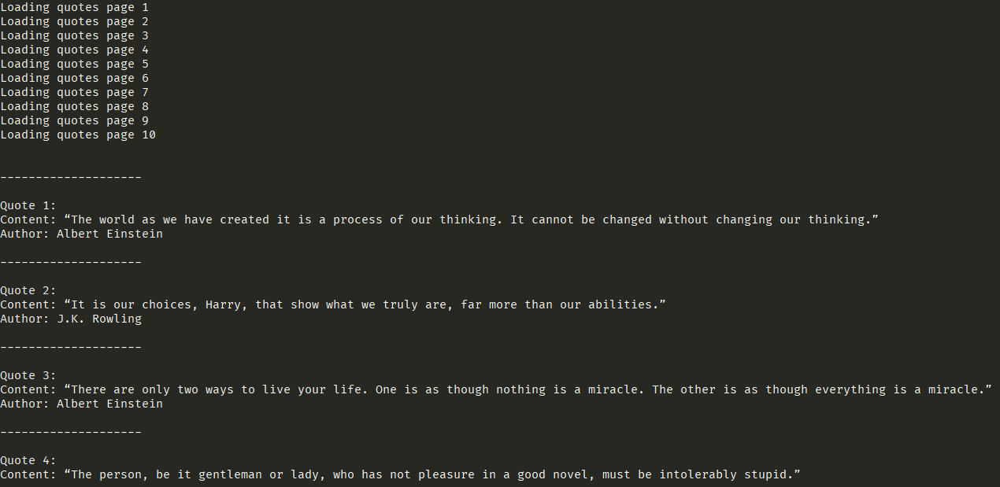

# Quote webscrapper
This code in Rust scraps some quotes [quotes to scrap](https://quotes.toscrape.com/) and shows to to user all 100 quotes.

### Preview

# Dependencies
- [select](https://crates.io/crates/select) - Parses html website body
- [reqwest](https://crates.io/crates/reqwest) - Http client to get response from website
